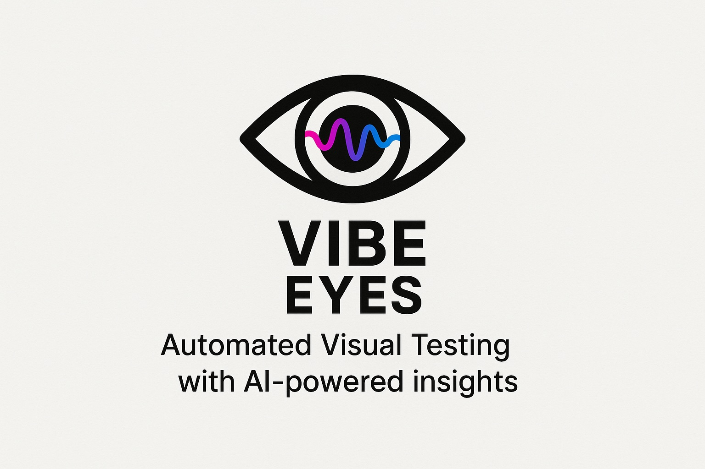

# Eyes MCP Server - Automated Visual Testing Framework

A Model Context Protocol (MCP) server that provides comprehensive automated testing capabilities including unit test generation, end-to-end testing with Playwright, visual regression testing, and OCR-based text validation.

A humble attempt to bridge the gap between traditional testing and AI-powered visual testing and make vibe coding more enjoyable.

## Overview

Eyes MCP Server enables AI assistants like Claude to perform sophisticated testing operations on web applications. It combines multiple testing approaches into a unified framework that can catch bugs traditional testing might miss, particularly visual regressions and UI inconsistencies.

## Core Capabilities

### Test Generation and Execution
- **Automatic unit test generation** for TypeScript/JavaScript codebases using Vitest
- **End-to-end testing** with Playwright browser automation (supports attended mode for visual debugging)
- **Visual regression testing** comparing screenshots against baseline images
- **OCR text extraction** for validating text in images and screenshots
- **HTML report generation** with embedded screenshots and metrics

### Advanced Features
- **Attended mode** for visual test debugging - watch tests run in a real browser window
- **Sub-agent integration** - Automatic testing after code changes with Claude Code
- **Retry mechanism** for handling flaky tests
- **Performance tracking** with execution time metrics
- **Automatic baseline generation** on first run
- **Multi-language OCR support** (English, Arabic, French, German, Spanish)
- **Dropdown and form interaction** support (click, type, select, hover, scroll)
- **AI Vision Models** (Optional - requires Ollama) for qualitative visual checks

## Installation

```bash
# Clone or download the project
cd ~/Downloads/eyes

# Install dependencies
pnpm install

# Build the TypeScript code
pnpm build

# Install Playwright browsers (required for E2E testing)
npx playwright install chromium

# Add to Claude using the MCP CLI
claude mcp add eyes node $(pwd)/dist/index.js
```

## 🤖 Automatic Testing with Sub-Agent

This project includes a pre-configured testing sub-agent that automatically tests your code changes. The agent is located at `.claude/agents/eyes-tester.md` and:

- **Runs automatically** after code changes
- **Uses attended mode by default** for visibility (browser attempts to open)
- **Selects appropriate tests** based on what changed
- **Generates comprehensive reports**

### Using the Sub-Agent

```javascript
// Claude will automatically invoke after changes:
Task(subagent_type="eyes-tester", prompt="Test the recent changes")

// The agent defaults to attended mode for better visibility
// Note: Due to MCP limitations, browser may run in background
```

For detailed setup instructions, see [Sub-Agent Setup Guide](docs/SUBAGENT_SETUP.md).

## Configuration for Claude Code

To use Eyes MCP Server with Claude Code, add it to your VS Code settings:

```json
{
  "claude-code.mcpServers": {
    "eyes": {
      "command": "node",
      "args": ["/absolute/path/to/eyes/dist/index.js"],
      "env": {
        "OLLAMA_HOST": "http://127.0.0.1:11434"
      }
    }
  }
}
```

## Available Tools

### 1. generate_unit_tests
Generates Vitest unit tests for specified files or directories.

**Parameters:**
- `targetPath` (string, required): Path to file or directory
- `testStrategy` (string): "basic", "comprehensive", or "edge-cases"

### 2. run_unit_tests
Executes Vitest unit tests and returns parsed results.

**Parameters:**
- `testPath` (string): Specific test path (optional)
- `coverage` (boolean): Include coverage report

### 3. run_e2e
Performs end-to-end testing with Playwright, capturing screenshots and validating assertions.

**Parameters:**
- `baseUrl` (string, required): Base URL of application
- `attendedMode` (boolean, optional): Run browser in visible mode instead of headless (default: false)
- `steps` (array, required): Test steps to execute

**Step Actions:**
- `navigate`: Go to a URL
- `click`: Click an element
- `type`: Enter text in a field
- `select`: Choose dropdown option
- `hover`: Hover over element
- `scroll`: Scroll page or to element
- `screenshot`: Capture screenshot
- `wait`: Pause execution

**Assertion Types:**
- `text`: Check if text exists in DOM
- `element`: Verify element presence
- `ocr`: Extract and validate text from screenshots
- `visual-diff`: Compare against baseline images
- `vlm-eval`: (Optional) AI-powered visual evaluation using Ollama

### 4. inspect_screenshots
Analyzes captured screenshots using OCR and visual comparison.

**Parameters:**
- `screenshotDir` (string, required): Directory containing screenshots
- `baselineDir` (string): Directory with baseline images
- `ocrLanguages` (array): Language codes for OCR

### 5. consolidate_report
Aggregates all test results into a unified JSON report.

**Parameters:**
- `outputPath` (string): Output file path

### 6. generate_html_report
Creates an interactive HTML report with embedded screenshots.

**Parameters:**
- `reportPath` (string): Path to JSON report
- `outputPath` (string): Path for HTML output

## Attended Mode (Visual Testing)

### Important Note for MCP Server Context
⚠️ **MCP Server Limitation**: When running through the MCP server (via Claude), the browser runs in a background service context and may not appear on screen even in attended mode. This is a fundamental limitation of how MCP servers work.

**Solution**: Use the standalone script `run-attended-test.js` to see the browser in action:

```bash
node run-attended-test.js
```

### Running Tests with Attended Mode

When using the MCP server tools, you can still enable attended mode (useful for slower execution and debugging):

```json
{
  "tool": "run_e2e",
  "args": {
    "baseUrl": "http://localhost:3000",
    "attendedMode": true,  // Browser window will be visible
    "steps": [
      {
        "action": "navigate",
        "value": "/"
      },
      {
        "action": "click",
        "selector": "#login-button"
      },
      {
        "action": "screenshot",
        "name": "login-page"
      }
    ]
  }
}
```

When attended mode is enabled:
- Browser window opens and stays visible
- Actions are slowed down by 500ms for better visibility
- Perfect for debugging test failures
- Useful for demonstrating test coverage to stakeholders

## Sub-Agent for Automatic Testing

Eyes MCP Server includes a specialized sub-agent (`eyes-tester`) that automatically runs tests after code changes. When using Claude Code:

1. The sub-agent is pre-configured in `.claude/agents/eyes-tester.md`
2. After making code changes, Claude will automatically invoke the testing agent
3. Tests run based on the type of changes detected:
   - UI changes trigger visual regression tests
   - Logic changes trigger unit tests
   - Configuration changes trigger smoke tests

Example of manual invocation:
```
Task(subagent_type="eyes-tester", prompt="Test the recent changes to the login component")
```

## Real-World Example

Here's an actual test execution result from the framework:

```json
{
  "timestamp": "2025-09-06T14:28:32.559Z",
  "summary": {
    "e2eTests": {
      "totalSteps": 23,
      "executedSteps": 15,
      "passedSteps": 14,
      "screenshots": 15
    },
    "visualTests": {
      "totalScreenshots": 16,
      "passedScreenshots": 12,
      "ocrChecks": 4
    }
  }
}
```

This test run executed 23 E2E steps, captured 15 screenshots, and performed OCR validation on 4 images, achieving a 93% pass rate for E2E tests and 75% for visual tests.

## Creating a CLAUDE.md File

To enable Claude Code to effectively use the Eyes MCP Server for testing your application, create a `CLAUDE.md` file in your project root with testing instructions:

### Example CLAUDE.md

```markdown
# Testing Instructions for Claude

This project uses the Eyes MCP Server for automated testing. When checking code changes or validating functionality, use these testing approaches:

## Quick Validation

For rapid feedback on code changes:
\`\`\`
1. Generate unit tests: generate_unit_tests with targetPath: "./src"
2. Run tests: run_unit_tests with coverage: true
3. Check coverage is above 80%
\`\`\`

## UI Testing

When UI components are modified:
\`\`\`
1. Start the development server (port 3000)
2. Run E2E tests: run_e2e with:
   - baseUrl: "http://localhost:3000"
   - steps: Test login flow, navigation, and key interactions
3. Inspect screenshots for visual regressions
4. Generate HTML report for review
\`\`\`

## Form Validation Testing

For forms and input validation, use the run_e2e tool:
\`\`\`
Tool: run_e2e
Arguments: {
  "baseUrl": "http://localhost:3000",
  "steps": [
    {
      "action": "type",
      "selector": "#email",
      "value": "invalid-email"
    },
    {
      "action": "click",
      "selector": "#submit"
    },
    {
      "action": "screenshot",
      "name": "validation-errors",
      "assertions": [{
        "kind": "ocr",
        "expected": "Please enter a valid email"
      }]
    }
  ]
}
\`\`\`

## Visual Regression Testing

Before deploying changes:
1. Capture screenshots of all major views
2. Compare against baselines using inspect_screenshots
3. Any difference above 5% requires manual review
4. Update baselines only after approval

## Performance Criteria

- Page load: < 3 seconds
- Test execution: < 30 seconds for full suite
- Visual diff threshold: < 5% pixel difference

## Critical User Flows to Test

1. **Authentication**: Login, logout, password reset
2. **Data Entry**: Form submission, validation, error handling
3. **Navigation**: All menu items, breadcrumbs, deep links
4. **Responsive Design**: Mobile, tablet, desktop views

## Test on Every Change

When you modify code, automatically:
1. Run relevant unit tests
2. Execute E2E tests for affected flows
3. Check visual regression
4. Generate report summarizing results

Use retries for network-dependent tests:
\`\`\`
Tool: run_e2e
Arguments: {
  "baseUrl": "http://localhost:3000",
  "steps": [
    {
      "action": "click",
      "selector": ".dynamic-button",
      "retries": 3,
      "timeout": 5000
    }
  ]
}
\`\`\`
```

## Best Practices

### Test Strategy
1. **Unit tests** for business logic and utilities
2. **E2E tests** for critical user journeys
3. **Visual tests** for UI consistency
4. **OCR validation** for dynamic content that changes frequently

### Performance Optimization
- Use parallel test execution where possible
- Cache baseline images locally
- Limit screenshot resolution for faster processing
- Use specific selectors over generic ones

### Debugging Failed Tests
1. Check the `.artifacts/` directory for screenshots
2. Review error messages in the JSON report
3. Use retry mechanism for timing-dependent operations
4. Verify selectors haven't changed in the application

### Continuous Integration
The framework is designed to work in CI/CD pipelines:
```bash
# Run complete test suite
node dist/index.js << EOF
{
  "tool": "run_e2e",
  "args": {
    "baseUrl": "$BASE_URL",
    "steps": $TEST_STEPS
  }
}
EOF
```

## Troubleshooting

### Common Issues

**OCR not finding text:**
- Ensure text is clearly visible in screenshot
- Try different language packs if multilingual
- Check image quality and resolution

**Visual regression false positives:**
- Dynamic content (timestamps, random data) causes differences
- Font rendering varies between systems
- Use masks for dynamic regions

**Playwright timeouts:**
- Increase timeout values for slow operations
- Add explicit wait steps
- Use retry mechanism for flaky elements

## Architecture

The framework consists of modular tools that can be used independently or chained together:

```
Input → Generate Tests → Run Tests → Capture Screenshots → Analyze Results → Generate Report
```

Each tool outputs structured data that can be consumed by the next tool in the pipeline, enabling flexible test workflows.

## Performance Metrics

Based on real-world usage:
- **Test generation**: ~100 tests per second
- **E2E execution**: ~2-5 seconds per step
- **OCR processing**: ~1-2 seconds per image
- **Report generation**: < 1 second

## Contributing

To extend the framework:

1. Add new tools in `src/tools/`
2. Register tools in `src/index.ts`
3. Follow TypeScript strict mode
4. Include error handling and validation
5. Update this documentation

## License

MIT